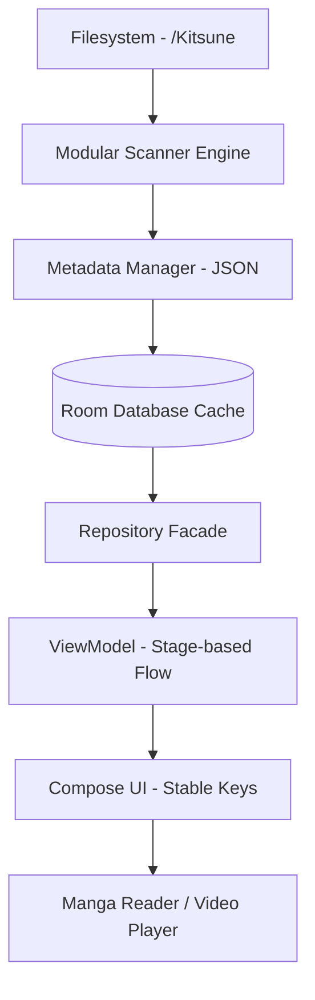

# KITSUNE

**Offline First Media Library & Reader for Android**

Kitsune is a high-performance, unified media manager designed for local consumption of digital comics and videos on Android. It prioritizes user privacy and data ownership by treating your local storage as the absolute source of truth.

Built with Jetpack Compose • Filesystem First • Hybrid SAF

<p align="left">
  
  
  
  
  
  
</p>

---

## 📋 Table of Contents
- [Overview](#-overview)
- [Why Kitsune?](#-why-kitsune)
- [Features](#-features)
- [Supported Media](#-supported-media)
- [Media Directory Structure](#-media-directory-structure)
- [How It Works](#-how-it-works)
- [Architecture](#-architecture)
- [Design Principles](#-design-principles)
- [Technology Stack](#-technology-stack)
- [Performance](#-performance)
- [Project Structure](#-project-structure)
- [Getting Started](#-getting-started)
- [Roadmap](#-roadmap)
- [Current Status](#-current-status)
- [Contributing](#-contributing)
- [License](#-license)

---

## 📖 Overview
Kitsune was created to solve the problem of fragmented and online-dependent media consumption. Most modern readers rely on cloud sync or centralized databases that break when files are moved. Kitsune changes this by using a **Filesystem First** approach where metadata follows the media, ensuring your library remains portable, resilient, and lightning-fast.

Our goal is to provide a single, modern entry point for all your local media, combining a powerful Manga reader with a robust Video player, all wrapped in a consistent and responsive Jetpack Compose interface.

---

## ✨ Why Kitsune?
*   **✔ Offline First:** Zero internet dependency. Your media stays on your device.
*   **✔ Filesystem First:** If the file is in your folder, it's in your library. No brittle database silos.
*   **✔ Metadata Portability:** Tags and information are stored in `metadata.json` alongside your media.
*   **✔ Hybrid SAF:** High-performance storage access using optimized Storage Access Framework implementation.
*   **✔ Modular Architecture:** Independent, stateless engines for Comics and Videos.
*   **✔ Privacy Focused:** No trackers, no accounts, and no telemetry.

---

## 🛠️ Features

| Feature | Description |
| :--- | :--- |
| **Comic Library** | Organized grid view with automatic cover generation from CBZ content. |
| **Video Library** | Support for series and movies with lazy episode discovery and progress badges. |
| **Advanced Reader** | High-performance CBZ reader with Vertical, LTR, and RTL support. |
| **Video Player** | Powered by Media3 ExoPlayer with gesture controls for Volume, Brightness, and Seek. |
| **Tag System** | Portable tagging system using `metadata.json` with asynchronous loading. |
| **Unified Bookmarks** | Organize both comics and videos in a single unified interface. |
| **Video Playlists** | Create and manage video-only playlists for sequential consumption. |
| **Incremental Scan** | Lightning-fast library updates using parallel scanning and modification checks. |
| **Search & Sort** | Debounced search and natural alphanumeric sorting (Chapter 2 < Chapter 10). |

---

## 📂 Supported Media

| Type | Formats |
| :--- | :--- |
| **Comic** | `.cbz`, Folder-based images (`jpg`, `jpeg`, `png`, `webp`) |
| **Video** | `mp4`, `mkv`, `mov`, `avi`, `webm`, `m4v`, `ts`, `3gp` |

---

## 📁 Media Directory Structure

Kitsune allows you to select any folder as your library root. For the application to correctly identify and categorize your media, it is required to use the following structure:

```text
Library-Root/ (User Selected)
├── Comics/             # Required folder for Comic scanner
│   ├── Series Title A/ # Title folder
│   │   ├── Chapter 01.cbz
│   │   ├── Chapter 02.cbz
│   │   ├── cover.jpg   # Optional (autogenerated if missing)
│   │   └── metadata.json
│   └── Series Title B/
│       └── ...
└── Videos/             # Required folder for Video scanner
    ├── Movie Title/    # Movie folder
    │   ├── Movie.mp4
    │   └── cover.jpg
    └── Show Title/     # Series folder
        ├── Episode 01.mkv
        ├── Episode 02.mp4
        └── metadata.json
```

- **Root Selection:** You define the entry point during initial setup.
- **Categorization:** The scanner looks specifically for `Comics/` and `Videos/` subdirectories to start the discovery process.
- **Portability:** Title metadata (`metadata.json`) is stored inside each title's folder. If you move the series folder, your tags and info move with it.

---

## ⚙️ How It Works

Kitsune translates your physical storage into a reactive UI state through an optimized layered pipeline.



*   **Scanning Phase:** `ScannerCoordinator` orchestrates parallel execution of `ComicScanner` and `VideoScanner`.
*   **Metadata Phase:** `MetadataManager` ensures atomic writes to `metadata.json` using a temporary file strategy.
*   **Mapping Phase:** ViewModels use a **Stage-based Flow** to separate heavy data preparation from light UI mapping.

---

## 🏗️ Architecture
Kitsune follows a **Clean MVVM (Model-View-ViewModel)** pattern, highly optimized for the high-latency nature of Android's Storage Access Framework.

*   **Filesystem First:** The filesystem is the only Source of Truth. The Room database acts as a transient, reactive cache.
*   **Modular Engines:** Comic and Video engines are decoupled, sharing only the UI foundation.
*   **Reactive State:** The entire UI is driven by Kotlin `Flow` and `StateFlow`, ensuring real-time updates.
*   **Manual Dependency Injection:** We avoid Hilt/Dagger to maintain a transparent, easy-to-debug object graph.

---

## 🛡️ Design Principles
1.  **Separation of Concerns:** Business logic is strictly kept out of UI and Scanner layers.
2.  **Stateless Engines:** Scanners do not hold mutable state, ensuring thread safety during parallel runs.
3.  **Relative Path Identification:** Media is identified by its path relative to the library root, ensuring portability.
4.  **Natural Sorting:** Mandatory alphanumeric sorting (e.g., `Chapter 2` comes before `Chapter 10`).

---

## 🛠️ Technology Stack

| Technology | Purpose |
| :--- | :--- |
| **Kotlin** | Primary programming language. |
| **Jetpack Compose** | Modern declarative UI framework. |
| **Room DB** | Reactive local caching and user data persistence. |
| **Media3 (ExoPlayer)** | Professional-grade video playback engine. |
| **Coil** | High-performance image loading with custom URI caching. |
| **Kotlin Coroutines** | Asynchronous task management and parallel scanning. |
| **Navigation Compose** | Single-activity routing with safe navigation guards. |
| **Kotlinx Serialization** | Fast and portable JSON metadata parsing. |

---

## ⚡ Performance
Kitsune is tuned for real-world performance on physical devices:
*   **🚀 URI LRU Cache:** Avoids repeated expensive SAF Binder calls by caching resolved URIs.
*   **🛡️ Navigation Guards:** Prevents duplicate screen launches and backstack bloat via `navigateSafe`.
*   **🧵 Parallel Scanning:** Scans Comics and Videos simultaneously without blocking the main thread.
*   **📦 Stage-based Flow:** Heavy list processing is divided into stages with `distinctUntilChanged` to minimize recompositions.
*   **🖼️ Image Tuning:** Aggressive disk/memory cache for covers and CBZ pages.

---

## 📂 Project Structure
```text
app/src/main/java/com/kitsune/app/
├── core/         # SAF Helpers, URI Cache, Natural Sort, Date Utils
├── data/         # Repositories & Filesystem Metadata Management
├── database/     # Room Entities, DAOs, and Migration logic
├── domain/       # Pure Business Logic Models (Comic, Video, Episode)
├── navigation/   # Routing logic and navigateSafe guards
├── reader/       # Comic Engine - CBZ Parsing and speculation
├── scanner/      # Modular Scanner Engines and Coordinator
└── ui/           # Feature screens (Library, Detail, Reader) and Components
```

---

## 🚀 Getting Started
1.  **Clone the Repo:** `git clone https://github.com/youruser/kitsune.git`
2.  **Gradle Sync:** Open the project in Android Studio and allow it to sync.
3.  **Build & Run:** Deploy the `app` module to an Android 8.0+ device.
4.  **Setup Library:**
    *   On launch, select a root folder (e.g., `/Kitsune`).
    *   Place your comics in `/Comics` (CBZ format or image folders).
    *   Place your videos in `/Videos` (folder-per-title format).
5.  **Scan:** The app will automatically build your library from the filesystem.

---

## 🗺️ Roadmap
- [x] **Core Foundation:** Hybrid SAF and Room integration.
- [x] **Unified Media:** Comic and Video engines sharing UI components.
- [x] **Metadata System:** Portable `metadata.json` and tag management.
- [x] **Performance Tuning:** Parallel scanning and URI caching.
- [ ] **Phase 11: Backup & Restore:** Export collection data to the `/Backup` folder.
- [ ] **Phase 12: Advanced UI:** Custom accent colors and multi-column grid settings.
- [ ] **Future:** Folder monitoring (FileObserver) and external plugin system.

---

## 📍 Current Status
Kitsune has successfully completed **Phase 10.5 (Performance & Architecture Refactor)**. The application is stable, highly responsive, and feature-complete for local media management.

---

## 🤝 Contributing
Kitsune is an open-source project. We welcome pull requests for performance improvements, support for new media formats, and UI/UX refinements. Please ensure your code follows the **Manual DI** and **MVVM** guidelines established in the project.

---

## 📄 License
This project is licensed under the **MIT License**. See the `LICENSE` file for details.

---
<p align="center">Developed with ❤️ for the Offline Media Community.</p>
