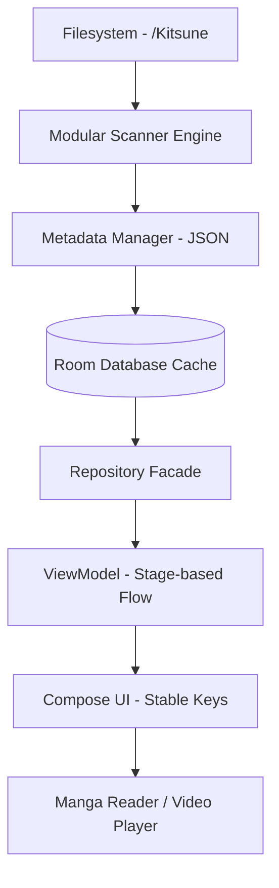

<p align="center">
  
</p>

<h1 align="center">KITSUNE</h1>

<p align="center">
  <strong>Offline First Media Library & Reader for Android</strong><br>
  Filesystem First • Hybrid SAF • Jetpack Compose
</p>

<p align="center">
  
  
  
  
  
  
</p>

---

## 📋 Table of Contents
- [Overview](#-overview)
- [Why Kitsune?](#-why-kitsune)
- [Screenshots](#-screenshots)
- [Features](#-features)
- [Supported Media](#-supported-media)
- [How It Works](#-how-it-works)
- [Architecture](#-architecture)
- [Design Principles](#-design-principles)
- [Technology Stack](#-technology-stack)
- [Performance](#-performance)
- [Project Structure](#-project-structure)
- [Getting Started](#-getting-started)
- [Roadmap](#-roadmap)
- [Current Status](#-current-status)
- [Contributing](#-contributing)
- [License](#-license)

---

## 📖 Overview

**Kitsune** is a modern, high-performance media manager designed for Android users who value privacy and data ownership. It provides a unified platform to organize and consume your local collection of digital comics (Manga) and video series.

### The Problem
Most modern media applications rely heavily on cloud synchronization or centralized databases. When you move your files, your metadata, bookmarks, and progress are often lost. Furthermore, existing solutions frequently mix online streaming with local playback, leading to cluttered interfaces and privacy concerns.

### The Solution
Kitsune introduces a **Filesystem First** philosophy. By using the Android Storage Access Framework (SAF) and storing metadata (`metadata.json`) directly within your media folders, Kitsune ensures that your library is portable, resilient, and entirely offline. Whether you move your SD card to a new phone or reorganize your folders, Kitsune keeps your collection intact.

---

## ✨ Why Kitsune?

*   **🌐 100% Offline:** No internet connection is ever required. Your data never leaves your device.
*   **📂 Filesystem Source of Truth:** Your folders define your library. No brittle database silos.
*   **📦 Metadata Portability:** Tags and info are stored in `metadata.json` alongside your media files.
*   **⚡ Blazing Fast:** Built with a custom modular scanner and URI caching for instant response.
*   **📺 Unified Foundation:** A single, consistent UI for both comics and videos.
*   **🛠️ Developer Friendly:** Clean code, manual DI, and modern Android standards.

---

## 📸 Screenshots

<p align="center">
  
  
  
  
</p>
<p align="center"><em>Note: Placeholders for visual representation. Actual screenshots coming soon.</em></p>

---

## 🛠️ Features

| Feature | Description |
| :--- | :--- |
| **Comic Library** | Organized grid view with automatic cover generation from chapter content. |
| **Video Library** | Support for series and movies with lazy episode discovery and "Finished" badges. |
| **Advanced Reader** | High-performance CBZ reader with Vertical, LTR, and RTL support. |
| **Video Player** | Integrated Media3 ExoPlayer with gesture controls for Volume, Brightness, and Seek. |
| **Tag System** | Portable tagging system using `metadata.json` with async loading. |
| **Unified Bookmarks** | Organize both comics and videos into custom categories. |
| **Video Playlists** | Exclusive playlist management for sequential video consumption. |
| **Incremental Scan** | Intelligent scanning that only processes modified folders to save battery. |
| **Selection Mode** | Bulk management for bookmarks, playlists, and library cleanups. |

---

## 📂 Supported Media

| Type | Formats |
| :--- | :--- |
| **Comic** | `.cbz`, Folders (containing `jpg`, `jpeg`, `png`, `webp`) |
| **Video** | `mp4`, `mkv`, `mov`, `avi`, `webm`, `m4v`, `ts`, `3gp` |

---

## ⚙️ How It Works

Kitsune translates your physical storage into a reactive UI state through an optimized layered pipeline.



*   **Scanning Phase:** `ScannerCoordinator` orchestrates parallel execution of `ComicScanner` and `VideoScanner`.
*   **Metadata Phase:** `MetadataManager` ensures atomic writes to `metadata.json` using a temporary file strategy.
*   **Mapping Phase:** ViewModels use a **Stage-based Flow** to separate heavy data preparation from light UI mapping.

---

## 🏗️ Architecture

Kitsune follows a **Clean MVVM (Model-View-ViewModel)** pattern, highly optimized for the high-latency nature of Android's Storage Access Framework.

*   **Filesystem First:** The filesystem is the only Source of Truth. The Room database acts as a transient, reactive cache.
*   **Modular Engines:** Comic and Video engines are decoupled, sharing only the UI foundation.
*   **Reactive State:** The entire UI is driven by Kotlin `Flow` and `StateFlow`, ensuring real-time updates.
*   **Manual Dependency Injection:** We avoid Hilt/Dagger to maintain a transparent, easy-to-debug object graph.

---

## 🛡️ Design Principles

1.  **Separation of Concerns:** Strict boundaries between Scanner, Data, and UI layers.
2.  **Stateless Engines:** Scanners do not hold mutable state, ensuring thread safety during parallel runs.
3.  **Relative Path Identification:** Media is identified by its path relative to the library root, ensuring portability.
4.  **Natural Sorting:** Mandatory alphanumeric sorting (e.g., `Chapter 2` comes before `Chapter 10`).

---

## ⚡ Performance

Kitsune is engineered for a 60fps experience on physical hardware:

*   **🚀 URI LRU Cache:** Caches resolved SAF URIs in memory, reducing system Binder calls by up to 90%.
*   **🛡️ Navigation Guards:** Prevents duplicate screen launches and backstack bloat via `navigateSafe`.
*   **🧵 Parallel Scanning:** Comics and Videos are scanned simultaneously without blocking the main thread.
*   **📦 Stage-based Flow:** Heavy list processing is divided into stages with `distinctUntilChanged` to minimize recompositions.
*   **🖼️ Image Tuning:** Aggressive disk/memory cache for covers and CBZ pages.

---

## 📂 Project Structure

```text
app/src/main/java/com/kitsune/app/
├── core/         # SAF Helpers, URI Cache, Natural Sort, Date Utils
├── data/         # Repositories & Filesystem Metadata Management
├── database/     # Room Entities, DAOs, and Migration logic
├── domain/       # Pure Business Logic Models (Comic, Video, Episode)
├── navigation/   # Routing logic and navigateSafe guards
├── reader/       # Comic Engine - CBZ Parsing and image handling
├── scanner/      # Modular Scanner Engines and Coordinator
└── ui/           # Feature screens (Library, Detail, Reader) and Components
```

---

## 🚀 Getting Started

### Prerequisites
- Android device running Android 8.0 (API 26) or higher.
- A collection of media organized into folders.

### Installation
1.  **Clone the Repo:** `git clone https://github.com/youruser/kitsune.git`
2.  **Gradle Sync:** Open the project in Android Studio and allow it to sync.
3.  **Build & Run:** Deploy the `app` module to your device.

### Library Setup
1.  On first launch, select a root folder (we recommend creating a folder named `/Kitsune`).
2.  Inside your root folder, Kitsune will expect (or create):
    - `/Comics` - Place your `.cbz` files or image folders here.
    - `/Videos` - Place your video titles (each title in its own folder) here.
3.  The app will automatically perform an initial scan and build your library.

---

## 🗺️ Roadmap

- [x] **Phase 1-9:** Core Foundation, Unified Media, Metadata (`metadata.json`).
- [x] **Phase 10:** Performance Tuning & Modular Scanner Refactor.
- [ ] **Phase 11: Backup & Restore:** Exporting and importing collection data to/from the `/Backup` folder.
- [ ] **Phase 12: Advanced UI:** Custom accent colors and multi-column grid configurations.
- [ ] **Future:** Folder monitoring (FileObserver) and external plugin system.

---

## 📍 Current Status

Kitsune has successfully completed **Phase 10.5 (Performance & Architecture Refactor)**. The application is stable, highly responsive, and feature-complete for local media management. We are currently moving toward the **Backup & Restore** milestone.

---

## 🤝 Contributing

Kitsune is an open-source project. We welcome pull requests for:
- Performance improvements.
- Support for new media formats.
- UI/UX refinements.

Please ensure your code follows the **Manual DI** and **MVVM** guidelines established in the project.

---

## 📄 License

Kitsune is licensed under the **MIT License**. See the `LICENSE` file for more details.

---

<p align="center">Developed with ❤️ for the Offline Media Community.</p>
