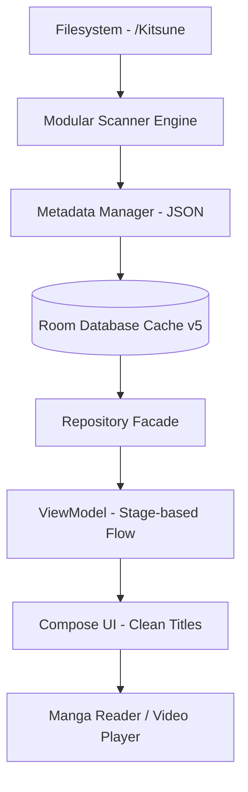

# KITSUNE

**Offline First Media Library & Reader for Android**

Kitsune is a high-performance, unified media manager designed for local consumption of digital comics and videos on Android. It prioritizes user privacy and data ownership by treating your local storage as the absolute source of truth.

Built with Jetpack Compose • Filesystem First • Hybrid SAF • Automatic Metadata

<p align="left">
  
  
  
  
  
  
</p>

---

## 📋 Table of Contents
- [Overview](#-overview)
- [Why Kitsune?](#-why-kitsune)
- [Features](#-features)
- [Supported Media](#-supported-media)
- [Media Directory Structure](#-media-directory-structure)
- [How It Works](#-how-it-works)
- [Architecture](#-architecture)
- [Design Principles](#-design-principles)
- [Technology Stack](#-technology-stack)
- [Performance](#-performance)
- [Project Structure](#-project-structure)
- [Getting Started](#-getting-started)
- [Roadmap](#-roadmap)
- [Current Status](#-current-status)
- [Contributing](#-contributing)
- [License](#-license)

---

## 📖 Overview
Kitsune was created to solve the problem of fragmented and online-dependent media consumption. Most modern readers rely on cloud sync or centralized databases that break when files are moved. Kitsune changes this by using a **Filesystem First** approach where metadata follows the media, ensuring your library remains portable, resilient, and lightning-fast.

Our goal is to provide a single, modern entry point for all your local media, combining a powerful Manga reader with a robust Video player, all wrapped in a consistent and responsive Jetpack Compose interface.

---

## ✨ Why Kitsune?
*   **✔ Offline First:** Zero internet dependency. Your media stays on your device.
*   **✔ Filesystem First:** If the file is in your folder, it's in your library. No brittle database silos.
*   **✔ Automatic Metadata:** Smart parsing of folder names to extract Author, Language, and Clean Titles.
*   **✔ Metadata Portability:** Tags and information are stored in `metadata.json` alongside your media.
*   **✔ Hybrid SAF:** High-performance storage access using optimized Storage Access Framework implementation.
*   **✔ Modular Architecture:** Independent, stateless engines for Comics and Videos.
*   **✔ Privacy Focused:** No trackers, no accounts, and no telemetry.

---

## 🛠️ Features

| Feature | Description |
| :--- | :--- |
| **Automatic Parsing** | Detects `[LANG] [AUTHOR] Title` folder patterns to organize your library instantly. |
| **Advanced Reader** | High-performance CBZ reader with **In-Reader Reading Mode Switcher** (Vertical, LTR, RTL). |
| **Enhanced Search** | Multi-field search across Titles, Authors, Language codes, and Tags. |
| **Flexible Sorting** | Sort by Title (A-Z/Z-A), Author, or Date Added. |
| **Video Player** | Powered by Media3 ExoPlayer with **MTK Hardware Recovery** and External Player fallback. |
| **Tag System** | Portable tagging system using `metadata.json` with asynchronous loading. |
| **Unified Bookmarks** | Organize both comics and videos in a single unified interface. |
| **Video Playlists** | Create and manage video-only playlists for sequential consumption. |
| **Incremental Scan** | Lightning-fast library updates using parallel scanning and modification checks. |
| **Stability** | Automated recovery from hardware decoder crashes and detailed technical logs. |

---

## 📂 Supported Media

| Type | Formats |
| :--- | :--- |
| **Comic** | `.cbz`, Folder-based images (`jpg`, `jpeg`, `png`, `webp`) |
| **Video** | `mp4`, `mkv`, `mov`, `avi`, `webm`, `m4v`, `ts`, `3gp` (with H.264/H.265 fallback) |

---

## 📁 Media Directory Structure

Kitsune allows you to select any folder as your library root. The application automatically parses your folder structure to extract metadata:

```text
Library-Root/ (User Selected)
├── Comics/
│   ├── [EN] [Oda] One Piece/   # Auto-parsed as: Lang=EN, Author=Oda, Title=One Piece
│   │   ├── Chapter 01.cbz
│   │   ├── cover.jpg
│   │   └── metadata.json       # Source of truth for tags
│   └── Naruto/                 # Standard fallback to folder name
│       └── ...
└── Videos/
    ├── [JP] Makoto Shinkai/    # Video parsing (Series format)
    │   ├── Your Name.mp4
    │   └── cover.jpg
    └── Movie Title/
        └── Movie.mkv
```

- **Clean Titles:** The UI displays the "Clean Title" while the internal logic preserves the folder name for I/O.
- **Portability:** Metadata (`metadata.json`) always takes priority and moves with your folders.

---

## ⚙️ How It Works

Kitsune translates your physical storage into a reactive UI state through an optimized layered pipeline.



*   **Regex Parsing:** `ComicScanner` uses a specific regex pattern to extract info from folder names during the scanning phase.
*   **Database Migration:** Room handles automatic schema upgrades (v3 -> v5) to accommodate Author and Language fields.
*   **Decoder Fallback:** If a hardware decoder fails (Error 4003/MTK), the player automatically triggers a software fallback or external intent.

---

## 🏗️ Architecture
Kitsune follows a **Clean MVVM (Model-View-ViewModel)** pattern, highly optimized for the high-latency nature of Android's Storage Access Framework.

*   **Filesystem First:** The filesystem is the only Source of Truth. The Room database acts as a transient, reactive cache.
*   **Modular Engines:** Comic and Video engines are decoupled, sharing only the UI foundation.
*   **Manual Dependency Injection:** We avoid Hilt/Dagger to maintain a transparent, easy-to-debug object graph.

---

## 🛠️ Technology Stack

| Technology | Purpose |
| :--- | :--- |
| **Kotlin 2.0** | Latest language features and compiler optimizations. |
| **Jetpack Compose** | Modern declarative UI framework with Stable Keys support. |
| **Room DB v5** | Local caching with robust migration paths and search indexing. |
| **Media3 (ExoPlayer)** | Pro video engine with custom LoadControl and MTK recovery. |
| **Coil** | High-performance image loading with custom URI caching. |
| **Navigation Compose** | Single-activity routing with `navigateSafe` guards. |

---

## ⚡ Performance
Kitsune is tuned for real-world performance on physical devices:
*   **🚀 URI LRU Cache:** Avoids repeated expensive SAF Binder calls by caching resolved URIs.
*   **🛡️ Navigation Guards:** Prevents duplicate screen launches and backstack bloat.
*   **📦 Stage-based Flow:** List processing is divided into stages to minimize recompositions.
*   **🛠️ Recovery Logic:** Intelligent detection of hardware decoder crashes to prevent black screens.

---

## 🗺️ Roadmap
- [x] **Core Foundation:** Hybrid SAF and Room integration.
- [x] **Unified Media:** Comic and Video engines sharing UI components.
- [x] **Metadata System:** Portable `metadata.json` and tag management.
- [x] **Phase 11: Advanced Metadata & Recovery:** [COMPLETED]
    - Automatic Folder Parsing (`[LANG] [AUTHOR] Title`).
    - Multi-field Search & Advanced Sorting.
    - In-Reader Reading Mode Switcher.
    - Media3 Hardware Decoder Recovery (MTK fix).
- [ ] **Phase 12: Backup & Restore:** Export collection data to the `/Backup` folder.
- [ ] **Phase 13: Themes & Customization:** Custom accent colors and multi-column settings.

---

## 📍 Current Status
Kitsune has successfully completed **Phase 11.2 (Advanced Metadata & UI Polish)**. The application is highly stable, feature-rich, and ready for advanced local media management.

---

## 📄 License
This project is licensed under the **MIT License**. See the `LICENSE` file for details.

---
<p align="center">Developed with ❤️ for the Offline Media Community.</p>
